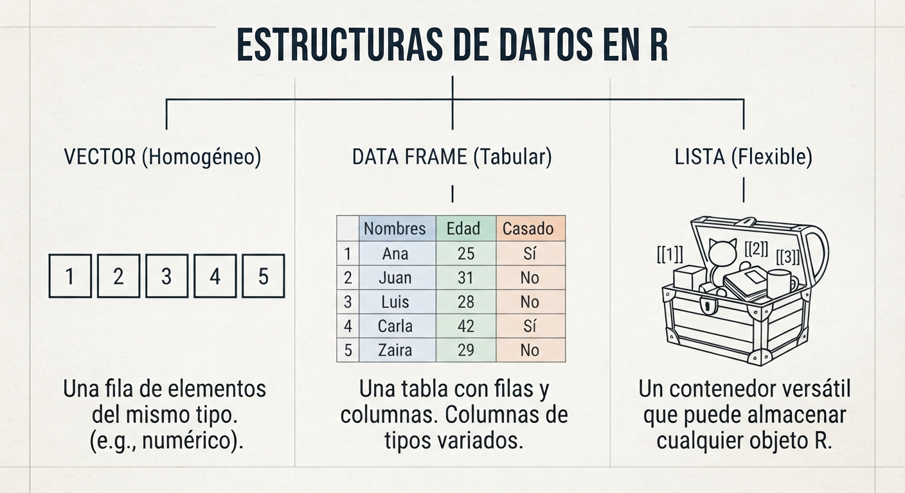
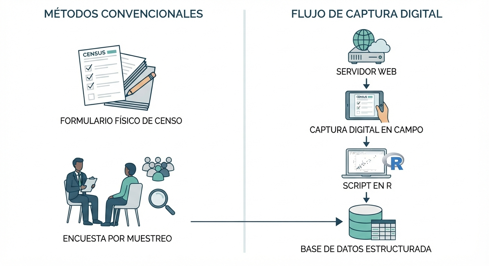

# Adquisición de Datos y Configuración del Entorno

::: {.callout-note}
### Cobertura del Módulo

Este capítulo cubre las **Sesiones 1, 2 y 3 (Semana 1)** de la materia. Está diseñado para sentar las bases conceptuales, metodológicas y de entorno necesarias antes de proceder a la manipulación de datos.
:::

Este capítulo inicial sienta las bases técnicas y metodológicas necesarias para afrontar con éxito el ciclo de vida del análisis de datos. En primer lugar, abordaremos la configuración de un entorno de trabajo reproducible basado en proyectos y buenas prácticas de organización. Posteriormente, estudiaremos la fundamentación estadística de los datos antes de proceder a la ingesta práctica de archivos planos, hojas de cálculo, APIs y Web Scraping.

## Configuración del Entorno y Flujo de Trabajo Basado en Proyectos

Para garantizar la reproducibilidad de nuestras investigaciones, utilizaremos de manera obligatoria el ecosistema conformado por **R**, el entorno de desarrollo integrado **RStudio** y el sistema de control de versiones **Git/GitHub**. 

En el análisis de datos profesional, el uso de rutas absolutas rígidas (como `C:/Usuarios/MiNombre/Documentos/datos.csv`) o el empleo manual de `setwd()` son considerados malas prácticas que rompen la reproducibilidad @stoudt2021principles. 

Para solucionar esto, RStudio introduce los **Proyectos de RStudio** (archivos con extensión `.Rproj`). Al abrir un proyecto, RStudio establece automáticamente el directorio de trabajo activo en la carpeta donde reside el archivo `.Rproj`. Esto permite gestionar todo el código mediante **rutas relativas** (por ejemplo, `"data/ventas.csv"`), garantizando que el proyecto funcione de forma idéntica en cualquier otra computadora.

### Estructura de Carpetas Recomendada

Todo proyecto analítico ordenado debe seguir una jerarquía estricta de subdirectorios dentro del directorio raíz @stoudt2021principles:

```text
mi-proyecto/
├── mi-proyecto.Rproj  <- Archivo de proyecto de RStudio
├── data/              <- Carpeta contenedora de datos
│   ├── raw/           <- Datos originales (¡NUNCA SE MODIFICAN!)
│   └── processed/     <- Datos limpios listos para análisis
├── scripts/           <- Scripts de código R (.R) o documentos Quarto (.qmd)
├── figuras/           <- Gráficos y visualizaciones exportadas
└── docs/              <- Reportes, presentaciones y documentación adicional
```

### Buenas Prácticas de Nomenclatura

Para evitar conflictos de codificación en distintos sistemas operativos y facilitar la legibilidad del código, se establecen las siguientes directrices de nomenclatura para archivos, scripts y variables:

*   **Minúsculas siempre**: Utilizar siempre letras minúsculas (evitar `DatosVentas.csv`, preferir `datos_ventas.csv`).
*   **Sin espacios ni caracteres especiales**: Reemplazar espacios por guiones medios (`-`) o bajos (`_`). Nunca usar tildes, la letra "ñ" o caracteres especiales en nombres de archivos o variables.
*   **Nombres autodescriptivos pero cortos**: El nombre debe indicar claramente el contenido (ej. `01_limpieza_ingresos.R`).
*   **Secuenciación de scripts**: Si el análisis requiere varios pasos, anteponer números secuenciales para indicar el orden de ejecución (ej. `01_ingesta.R`, `02_limpieza.R`, `03_eda.R`).

::: {.callout-note}
### Actividad de Paso: Creación de la Estructura de un Proyecto (3 minutos)

1. Abre RStudio. Go to **File > New Project...**
2. Selecciona **New Directory > New Project**. Nombra tu proyecto en minúsculas y sin espacios (ej. `analisis-ventas-bolivia`).
3. En la pestaña **Files** (panel inferior derecho), haz clic en **New Folder** y crea la estructura base descrita anteriormente (`data`, `data/raw`, `data/processed`, `scripts`, `figuras`).
:::

## Sintaxis Básica y Operaciones en la Consola

Esta sigue el principio matemático de: 

$$
f(x)=y\\
comando(arg1,arg2, \ldots)
$$

, donde aplicamos una **función** a un **argumento** para obtener un resultado.

::: {.panel-tabset}
### R como Calculadora
R maneja operaciones de alta precisión respetando el orden algebraico estándar:
```r
# Operaciones aritméticas
(1500 * 0.15) + 200  # Cálculo de interés
sqrt(144)            # Función raíz cuadrada
10^2                 # Potenciación
```
### Operadores Lógicos
Esenciales para el filtrado de reglas de negocio en BI, devuelven valores `TRUE` o `FALSE`:
```r
100 >= 50    # Mayor o igual
10 == 10     # Igualdad estricta (doble igual)
10 != 5      # Diferente de
(5 > 3) & (10 < 2) # Operador Y (AND)
```

### Palabras Reservadas
R tiene términos protegidos con significados técnicos específicos:

*   `NA`: Dato perdido (*Not Available*).
*   `NULL`: Objeto vacío o inexistente.
*   `NaN`: Error en cálculo numérico (*Not a Number*).
*   `Inf`: Infinito matemático.

### Clases

```r
class(100)    # numérica
class("hola") # Texto, caractér
class(2>3)    # Lógica
```
:::

::: {.callout-note}
### Actividad (5 min)
**Escenario:** Un cliente tiene un crédito de 50,000 USD a una tasa del 1.2% mensual.

1.  Use la **consola** como calculadora para hallar el interés del primer mes.
2.  Verifique si ese interés es mayor a 500 USD usando un operador lógico.
3.  Utilice el comando `?log` para investigar cómo calcular el logaritmo en base 10 del monto total del crédito.
:::

## Estructuras de Datos: Los Activos de Información

En R, todo es un **objeto**. Para crear estos activos en la memoria, utilizamos el operador de asignación `<-` (evite el uso de `=` para asignaciones, ya que puede confundirse con igualdad lógica).

### Estructuras Homogéneas (Mismo tipo de dato)

Contienen elementos de una sola clase (números, texto o lógicos):

*   **Scalar:** Un único valor individual.
*   **Vector:** Una colección indexada de valores columna. Se crean con la función combinar `c()`.
*   **Matriz:** Una estructura bidimensional donde todos los datos son del mismo tipo (ej. una tabla de puros montos financieros).
* **Array:** Una generalización de la matriz de mas de 2 dimensiones

::: {.panel-tabset}
### Scalar 

```r
s1  <-  2
s2  <-  "hola a todos"
s3  <-  3==4
```
### Vector
```r
v1  <-  c(2,4,6,8,10)
v2  <-  c("a", "b", "c", "hola", "buenos días")
v3  <-  v1>5
```

### Matriz
```r
m1  <-  matrix(c(1, 2, 3, 4) , 2, 2 )
m2  <-  matrix(c("a", "b", "c", "d") , 2, 2 )
m3  <-  m1>=2
```

### Array
```r
a1  <-  array(1:8, c(2, 2, 2))
```
:::

### Estructuras Heterogéneas (Múltiples tipos de datos)
Permiten combinar diferentes naturalezas de información, siendo las más poderosas para el analista:

*   **Data Frames:** Es el formato estándar de las bases de datos (tabular). Cada columna es una variable (puede ser de distinto tipo) y cada fila es una observación.
*   **Listas:** El objeto más flexible; puede contener vectores, matrices, modelos y hasta otras listas en un solo contenedor.

::: {.panel-tabset}
### Dataframe

```r
nombre  <- c("Maria", "Jose", "Ana")
edad  <-  c(19, 30, 23)
df1 <-  data.frame(nombre, edad)
df1
```

### Lista
```r
s1 <- 1; v1<-c(1,2)
l1 <- list(s1, v1, df1)
l1
```
:::



::: {.callout-important}
### Actividad: Creación de un Dataset Estratégico (5 min)
Debe registrar el desempeño de tres vendedores: Ana, Luis y Pedro. Vendieron 15, 20 y 12 unidades respectivamente.

1.  Cree el vector `vendedores` con los nombres.
2.  Cree el vector `ventas` con las unidades.
3.  Cree un dataframe llamado `df_comercial` que una ambos vectores.
4.  Use la función `str(df_comercial)` para inspeccionar la estructura de su base de datos.
:::

### Indexación

Se refiere al proceso de acceder, seleccionar o extraer elementos específicos dentro de las estructuras de datos en R (vectores, matrices, data frames y listas) utilizando operadores de extracción.

::: {.panel-tabset}
### Vectores
```r
set.seed(123) # Semilla aleatoria
v1<-runif(10) # Distribución uniforme de 0 a 1
v1[2]
v1[c(3,7)]
v1[2:5]
```

### Matrices y dataframe
```r
data(iris) #datos en R
iris[2,] #Fila
iris[,2] #Columna
iris[c(2, 5), c(1, 5)]
iris$Petal.Length #seleccionar variable
```

### Listas
```r
l1<-list(2, 1:10, iris)
l1[[2]]
l1[[3]]$Species
```
:::

## Fundamentos Metodológicos y Estadísticos de los Datos

Antes de escribir la primera línea de código para leer un archivo, es indispensable comprender la naturaleza metodológica y estadística del conjunto de datos con el que trabajaremos.

### Nomenclatura Estándar en Análisis de Datos

En el ámbito de la ciencia de datos y la estadística, interactuamos con diferentes estructuras de datos @wickham2023r:

*   **Datos Estructurados**: Información organizada en tablas formales de filas y columnas (dataframes), donde cada fila representa una observación y cada columna una variable.
*   **Datos Semiestructurados**: No tienen una estructura de tabla rígida pero contienen marcadores o etiquetas organizativas (ej. archivos JSON o XML).
*   **Datos No Estructurados**: Información sin un formato predefinido (ej. textos libres, audios, imágenes).
*   **Dataset (Conjunto de Datos)**: Colección estructurada de datos.
*   **Observación (o Caso)**: La unidad mínima sobre la cual se recopilan los datos (fila).
*   **Variable**: Una característica cuantitativa o cualitativa medida sobre las observaciones (columna).

### Fuentes de Información y su Naturaleza

La procedencia y el diseño de la recolección de los datos determinan el tipo de conclusiones estadísticas válidas que podemos extraer @groves2009survey:

*   **Censos**: Recolección de información sobre la totalidad de los elementos de una población de interés. Proporcionan parámetros poblacionales exactos pero conllevan altos costos y tiempos de ejecución.
*   **Encuestas por Muestreo**: Recolección de datos sobre un subconjunto representativo (muestra) extraído probabilísticamente de la población. Permiten realizar inferencia estadística sobre la población general con un margen de error controlable @groves2009survey.
*   **Registros Administrativos**: Datos recopilados de manera continua con propósitos de control institucional u operativo (ej. facturaciones de impuestos, registros de aduana, admisiones hospitalarias). Tienen la ventaja de ser económicos y continuos, pero no están diseñados con fines estadísticos, lo que suele requerir un exhaustivo trabajo de depuración.

Adicionalmente, según el nivel de control en la obtención de datos, distinguimos entre:

| Dimensión | Datos de Estudios Observacionales | Datos Transaccionales |
| --- | --- | --- |
| **Origen / Propósito** | Diseñados por un investigador para responder una hipótesis concreta. | Generados automáticamente por la operativa del negocio/sistema (ventas, clicks, facturas). |
| **Control sobre las variables** | **Sin intervención directa** en los sujetos, pero con control explícito en el instrumento de medición (encuestas, fichas clínicas). | Ninguno. Registra únicamente los eventos conforme suceden en el sistema. |
| **Volumen y Frecuencia** | Muestras finitas o acotadas (encuestas, cohortes) tomadas en momentos específicos. | Flujo continuo (*streaming*) de gran volumen (Big Data), en tiempo real o por lotes. |
| **Calidad y Limpieza** | Alta consistencia lógica previa, pues se diseñan variables y escalas predeterminadas. | Requiere un esfuerzo considerable de procesamiento, ya que suelen contener datos duplicados, nulos o con ruido. |
| **Capacidad de Inferencia** | Diseñados estadísticamente para inferir hacia una población o identificar asociaciones controlando sesgos. | Útiles para describir comportamientos históricos y patrones de uso; la inferencia estadística requiere sesgos de selección cuidadosos. |

### Población Objetivo y Unidad de Análisis

Antes de realizar la ingesta de un dataset, todo analista de datos debe responder con precisión dos preguntas fundamentales:

1.  **¿Cuál es la Población Objetivo (*Target Population*)?**: Es el conjunto completo de elementos sobre los cuales se desean realizar generalizaciones o inferencias @groves2009survey.
2.  **¿Cuál es la Unidad de Análisis?**: Es el elemento básico sobre el cual se realiza la medición o la observación en el dataset (ej. una persona, un hogar, una transacción, una escuela).

::: {.callout-important}
### Falacia Ecológica
Confundir la unidad de análisis puede llevarnos al sesgo de la **falacia ecológica**: cometer el error de deducir conclusiones sobre individuos a partir de datos agregados de un grupo (por ejemplo, asumir que porque un departamento del país tiene un PIB promedio alto, cada habitante seleccionado al azar de ese departamento es de ingresos altos).
:::

## Ingesta de Datos Estructurados

Una vez configurado nuestro proyecto y definida la naturaleza metodológica de nuestros datos, procedemos a cargarlos en la memoria de R para su análisis.

### Archivos Planos (CSV, TXT)

Los archivos de texto plano delimitados (como CSV o TXT) son los formatos más universales para el intercambio de datos estructurados. Estudiaremos dos enfoques de lectura: las funciones nativas de **Base R** y las funciones optimizadas del paquete **`readr`** (parte de `tidyverse`) @boehmke2016data.

::: {.panel-tabset}

### Enfoque Base R

Las funciones tradicionales como `read.csv()` no requieren cargar paquetes externos, pero presentan limitaciones históricas de rendimiento y coerción silenciosa de tipos de datos.

```r
# Lectura usando Base R
# stringsAsFactors = FALSE evita que columnas de texto se fuercen a factores categóricos
datos_base <- read.csv("data/raw/ventas_bolivia.csv", stringsAsFactors = FALSE)

# Inspeccionar estructura básica
str(datos_base)
```

### Enfoque `readr` (Recomendado)

El paquete `readr` está diseñado para la ciencia de datos moderna: es hasta 10 veces más rápido que Base R, lee los archivos directamente como `tibbles` (estructuras legibles de dataframes) y no realiza conversiones automáticas ni altera los nombres de las columnas @boehmke2016data.

```r
library(readr)

# Lectura moderna con readr
datos_readr <- read_csv("data/raw/ventas_bolivia.csv")

# Ver especificación de columnas detectada
spec(datos_readr)
```

:::

Para garantizar la correcta lectura de archivos con inconsistencias o estructuras complejas, se deben dominar los siguientes argumentos:

*   `col_names` / `header`: Define si la primera fila contiene los nombres de las variables (`TRUE` o `FALSE`).
*   `delim` / `sep`: Especifica el carácter delimitador de campos (ej. `,`, `;`, `\t` para tabuladores).
*   `na`: Define explícitamente qué strings deben interpretarse en R como un valor faltante real (`NA`). En bases de datos reales bolivianas, es común ver valores perdidos codificados como `"999"`, `"N/A"` o simplemente guiones `"-"`.
*   `skip`: Permite saltar un número determinado de líneas iniciales (muy común cuando los archivos contienen metadatos informativos en la cabecera antes de la tabla real de datos).

```r
# Ejemplo avanzado de ingesta controlada de un archivo CSV con inconsistencias
ventas_limpias <- read_csv(
  file = "data/raw/ventas_bolivia.csv",
  col_names = TRUE,
  na = c("999", "N/A", "-"),
  skip = 3,           # Omitir las primeras 3 líneas de metadatos o comentarios
  n_max = 1000        # Cargar solo las primeras 1000 observaciones para prueba rápida
)
```

::: {.callout-note}
### Actividad de Paso: Tipos de Datos Preventivos (3 minutos)
Al importar datos, identificadores categóricos como la Cédula de Identidad (CI) o códigos de sucursal pueden ser erróneamente interpretados por R como variables numéricas continuas sobre las cuales calcular medias o desviaciones estándar. 

Para prevenir esto, podemos forzar el tipo de dato correcto durante el proceso mismo de lectura:

::: {.panel-tabset}

### Enfoque Base R
```r
# Forzar columna 1 como numérico y columnas 2 y 3 como carácter
datos_preventivos <- read.csv(
  "data/raw/ventas_bolivia.csv",
  colClasses = c("numeric", "character", "character")
)
```

### Enfoque `readr`
```r
library(readr)
# Definir tipos específicos de columnas
datos_preventivos <- read_csv(
  "data/raw/ventas_bolivia.csv",
  col_types = cols(
    id_cliente = col_character(),
    ci_nit = col_character(),
    monto_bs = col_double()
  )
)
```
:::

:::

### Hojas de Cálculo (Microsoft Excel)

A diferencia de los archivos planos, los archivos de Microsoft Excel (`.xls`, `.xlsx`) son binarios y pueden albergar múltiples pestañas, estilos, celdas combinadas y fórmulas. 

Antes de leer una hoja de Excel en R, se debe asegurar que el diseño sea **tabular**:

1.  **Fila única de cabecera**: Los nombres de las variables deben estar en la primera fila. Evitar cabeceras dobles o celdas combinadas.
2.  **Una observación por fila**: No intercalar filas de totales, resúmenes parciales o comentarios intermedios.
3.  **Sin formatos de celda con significado analítico**: Si una celda pintada de rojo significa "mora", esa información debe convertirse en una variable explícita en su propia columna (ej. `estado_mora = "mora"`) antes de la ingesta, ya que R no leerá colores de relleno como datos analíticos.

Para importar estas hojas de manera eficiente y sin dependencias externas complejas, utilizaremos el paquete **`readxl`** de la suite `tidyverse` @boehmke2016data.

::: {.panel-tabset}

### Ingesta de Hoja por Defecto
```r
library(readxl)

# Lee la primera pestaña del libro de Excel de forma automática
datos_excel <- read_excel("data/raw/reporte_sucursales.xlsx")
```

### Ingesta de Pestaña Específica y Rangos
```r
library(readxl)

# Leer una pestaña específica por su nombre
datos_pestaña <- read_excel(
  path = "data/raw/reporte_sucursales.xlsx",
  sheet = "sucursal_lpz"
)

# Leer un rango específico de celdas delimitado
datos_rango <- read_excel(
  path = "data/raw/reporte_sucursales.xlsx",
  range = "B5:F105"
)
```

:::

## Adquisición de Datos desde la Web: APIs y Web Scraping

La recolección moderna de datos requiere, de forma indispensable, interactuar directamente con la web. Estudiaremos cómo automatizar este proceso mediante el consumo de APIs especializadas y Web Scraping de páginas HTML.

### Consumo de APIs con Librerías Especializadas

Una **API (Application Programming Interface)** es un canal estructurado provisto por un servidor web para transferir datos de manera automatizada. En lugar de procesar solicitudes manuales o lidiar con el diseño visual de un sitio web, consumimos APIs usando paquetes en R que actúan como envoltorios de conexión directa.

#### Caso Práctico 1: Banco Mundial (`wbstats`)

El paquete `wbstats` permite realizar búsquedas y descargas directas de los miles de indicadores macroeconómicos y sociales que publica el Banco Mundial.

```r
library(wbstats)

# Buscar el identificador de indicador para el PIB per cápita
pib_id <- wb_search("GDP per capita (current US\\$)")

# Descargar datos de Bolivia (código de país "BO") desde 2015 a 2024
pib_bolivia <- wb_data(
  indicator = "NY.GDP.PCAP.CD", 
  country = "BO", 
  start_date = 2015, 
  end_date = 2024
)

# Mostrar las primeras filas del indicador macroeconómico recuperado
head(pib_bolivia)
```

## Captura y Preservación de la Información

En el ámbito del análisis de datos, el primer paso crítico consiste en obtener información de calidad mediante un proceso sistemático de captura y preservación. Tradicionalmente, la estadística y la investigación social han dependido de **fuentes convencionales** como censos, encuestas por muestreo y registros administrativos. 

Sin embargo, en el ecosistema digital moderno, la Inteligencia de Negocios y la minería de datos exigen incorporar la captura de información generada en espacios digitales, redes sociales y portales web. Este cambio metodológico demanda del analista **mucha paciencia** y creatividad, ya que la interacción con áreas externas y el preprocesamiento de datos crudos consumen la mayor parte del esfuerzo técnico.

La justificación de este esfuerzo radica en la naturaleza de los datos del mundo real: independientemente de su origen, la mayoría de los datos son **ruidosos, inconsistentes y adolecen de valores perdidos**. Por ello, aunque la recopilación en la web pueda parecer de bajo costo, la creación de datos de alta calidad mediante limpieza, estandarización e integración representa una inversión considerable para cualquier organización.



| Característica | Estudio Observacional | Registro Transaccional |
| --- | --- | --- |
| **Origen** | Diseñado ex profeso (con intensión) para investigar o medir. | Generado automáticamente por una operación del día a día. |
| **Intención** | Analítica / Científica. | Operativa / Administrativa. |
| **Intervención** | El investigador diseña las preguntas o variables a medir. | El sistema registra el evento tal como sucede por necesidad operativa. |

## El Ciclo de Recopilación de Información (Los 5 Pasos de Iacus)

Para evitar sesgos y garantizar que la recolección automática de información de los sitios web sea un proceso científico [@Iacus2015], se debe seguir una secuencia metodológica estructurada:

```
[1. Definición de Necesidad] ──> [2. Identificación de Fuentes] ──> [3. Teoría de Generación]
                                                                            │
[5. Toma de Decisión y Raspado] <── [4. Balance y Aspecto Legal] <──────────┘
```

1.  **Definición de la Necesidad de Información:** Delimitar con precisión qué datos se requieren para apoyar una mejor toma de decisiones dentro del negocio.
2.  **Identificación de Fuentes en la Web:** Buscar portales digitales que contengan los atributos o propiedades requeridos para el estudio.
3.  **Teoría del Proceso de Generación de Datos:** Comprender quién genera el dato, con qué frecuencia se actualiza y qué sesgos potenciales puede contener la plataforma de origen.
4.  **Balance de Ventajas, Desventajas y Legalidad:** Evaluar la viabilidad técnica de la captura frente a las políticas de uso del portal y el archivo `robots.txt` del servidor. *https://www.ejemplo.com/robots.txt*
5.  **Toma de Decisión e Inicio de la Recopilación:** Diseñar el script de extracción automatizada resguardando la preservación y consistencia de los datos capturados.

::: {.callout-note}
### Actividad: Planificando la Captura (10 min)
**Instrucción:** En grupos de tres estudiantes, elijan un portal de comercio electrónico o de noticias de su país.

1. Definan un objetivo de negocio que requiera raspar ese sitio.
2. Identifiquen si los datos que obtendrán son el resultado de un estudio observacional o un registro transaccional.
3. Mencionen dos posibles inconsistencias o ruidos que esperan encontrar en la data cruda.
:::

## Fundamentos Tecnológicos de la Web: HTML y CSS

Para realizar la extracción automática de datos sin la intervención de un humano que navegue visualmente [@Mitchell2015], debemos entender el lenguaje con el que están construidas las páginas. El **HTML** (*HyperText Markup Language*) es un lenguaje de texto que se utiliza para estructurar y desplegar una página web.

HTML funciona bajo una **estructura jerárquica y entornos de encapsulamiento** definidos por etiquetas (tags) y atributos. Por ejemplo:

```html
<div class="oferta" id="sucursal_la_paz">
  <span class="producto">Laptop de Oficina</span>
  <span class="precio">750.00 USD</span>
</div>
```

En minería de datos, no necesitamos leer todo el código de una página. El diseño estético de la web utiliza hojas de estilo (CSS) que asignan clases (como `.producto` o `.precio`) a los elementos. Estas clases actúan como **selectores o direcciones postales** que le permiten a nuestro código en R extraer quirúrgicamente la información de interés.


## Raspado Web Práctico en R con `rvest`

En R, la librería diseñada para interactuar con páginas estáticas y realizar raspado web es **`rvest`**, la cual forma parte del universo de herramientas de **`tidyverse`**. Para facilitar la identificación del selector CSS de cualquier elemento sin inspeccionar manualmente el código, se emplea la extensión de navegador **SelectorGadget**.

::: {.panel-tabset}

### Instalación y Carga
Para comenzar a trabajar con `rvest`, instale el paquete desde el CRAN y cárguelo en su sesión de trabajo junto con el núcleo de `tidyverse`:
```r
# Instalación (se ejecuta una sola vez)
install.packages("rvest")

# Carga de librerías en la sesión actual
library(rvest)
library(dplyr)
```

### Funciones Clave
La extracción con `rvest` se basa en cuatro funciones secuenciales que procesan la información mediante la tubería o *pipe* (`%>%`):
*   `read_html()`: Carga y analiza la estructura jerárquica del documento HTML.
*   `html_nodes()`: Extrae los entornos específicos que coinciden con el selector CSS.
*   `html_text()`: Limpia el código de marcado y extrae únicamente el texto plano.
*   `html_table()`: Convierte tablas HTML (`<table>`) directamente en estructuras de datos de R (*data frames*).

### Ejemplo de Raspado
A continuación se presenta la sintaxis estándar para estructurar texto extraído de un contenedor web:
```r
library(rvest)
library(dplyr)

# 1. Leer el portal web de origen
url_portal <- "https://ejemplo-tienda-bolivia.com"
web_html   <- read_html(url_portal)

# 2. Capturar nodos y transformarlos a un vector de texto limpio
nombres_productos <- web_html %>%
  html_nodes(".producto") %>%
  html_text()
```
:::

::: {.callout-tip}
### Ejercicios

1. Obtén la tabla de esta fuente y genera un dataframe. https://www.bcb.gob.bo/tco_reporte_detalle_historico.php?fecha=2026-08-20 
2. Hacer web scraping de un portal de comercio electrónico, clasificados o supermercados locales en Bolivia.
3. Hacer un web scraping de una biblioteca universitaria digital en Bolivia y capturar una búsqueda de interés.
:::

## Interfaces de Programación de Aplicaciones (APIs)

Aunque el raspado web es una herramienta flexible, tiene una limitación: si el administrador de la página cambia el diseño o el nombre de las clases CSS, el código fallará. Como alternativa estructurada, existen las **APIs** (*Application Programming Interface*).

Las APIs son **puertas de entrada creadas por los administradores de una página web** que permiten el acceso controlado a información seleccionada en formatos amigables y altamente estructurados (como JSON o XML), aunque debido a esto no siempre contienen toda la información que el analista desea.

| Dimensión Analítica | Web Scraping Tradicional | Acceso por APIs Oficiales |
| :--- | :--- | :--- |
| **Estabilidad** | Baja (sensible a rediseños estéticos de la web)  | Alta (los esquemas de datos permanecen estables). |
| **Estructura** | No estructurada (requiere transformaciones complejas) | Altamente estructurada (JSON, XML listos para análisis). |
| **Limitaciones** | Bloqueos de IP por peticiones masivas | Regulado por cuotas de acceso y claves de autenticación. |

### Caso Práctico: Consumo de la API del Banco Mundial

La API del Banco Mundial ofrece acceso libre a más de **16,000 indicadores de series de tiempo** con una cobertura histórica superior a los 50 años para la mayoría de los países. En R, no necesitamos realizar peticiones HTTP manuales para consumir esta API, ya que existe la librería especializada **`wbstats`** que encapsula las consultas de manera directa.

```r
# Instalar y cargar la librería de acceso a la API del Banco Mundial
install.packages("wbstats")
library(wbstats)

# Buscar indicadores relacionados con el desempleo
busqueda_desempleo <- wb_search("unemployment")

# Descargar datos de desempleo para Bolivia desde el año 2000
datos_bolivia <- wb_data(
  country = "BO", 
  indicator = "SL.UEM.TOTL.ZS", 
  start_date = 2000, 
  end_date = 2025
)
```

::: {.callout-tip}
### Ejercicios de Aplicación Práctica

1.  **Raspado de Tipo de Cambio Oficial:** Diseñe un script en R utilizando `rvest` para extraer el precio de compra y venta del dólar estadounidense, así como la fecha de actualización, desde la página oficial del **Banco Central de Bolivia** (https://www.bcb.gob.bo). Asegúrese de guardar los resultados en un data frame estructurado con nombres de atributos limpios.
2.  **Estructuración de Ofertas Laborales:** Utilice la estructura de la plataforma **Trabajópolis** (https://www.trabajopolis.bo) para seleccionar un departamento de Bolivia y armar un data frame que contenga: título del empleo, empresa ofertante y salario (si está disponible). Identifique los desafíos de limpieza de texto asociados a este ejercicio.
3.  **Análisis de Tendencias con gtrendsR:** Instale la librería `gtrendsR` para consumir la API de Google Trends. Realice una consulta para evaluar en qué meses del año es más frecuente la búsqueda del término "descuentos" o "compras" en Bolivia, y comente cómo esta información apoya la analítica predictiva de una empresa de retail.
:::